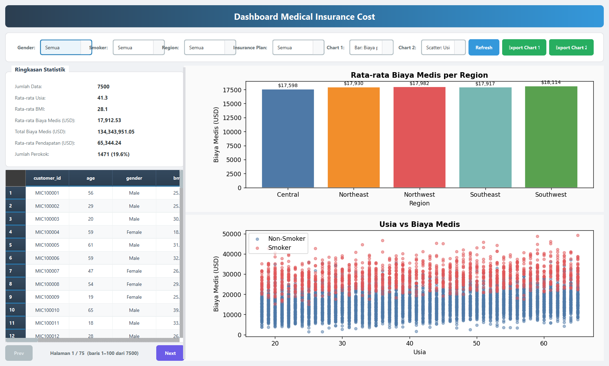

# Dashboard Medical Insurance Cost

**Nama:** Muharromi Ali Ilham
**NIM:** F1D02410082
**Kelas:** C

## Deskripsi

Aplikasi dashboard untuk memvisualisasikan dataset Medical Insurance Cost. Dashboard menampilkan data mentah dalam tabel, ringkasan statistik, serta chart Matplotlib.

## Dataset

- **Sumber:** [Medical Insurance Cost Dataset — Kaggle](https://www.kaggle.com/datasets/mirzayasirabdullah07/medical-insurance-cost-dataset/data)

### Penjelasan Kolom Utama

| Kolom | Tipe | Deskripsi |
|---|---|---|
| `customer_id` | String | ID pelanggan (MIC100001, dst.) |
| `age` | Integer | Usia pelanggan (tahun) |
| `gender` | String | Jenis kelamin (Male / Female) |
| `bmi` | Float | Body Mass Index, indikator berat badan relatif terhadap tinggi |
| `children` | Integer | Jumlah tanggungan anak |
| `smoker` | String | Status merokok (Yes / No) |
| `region` | String | Wilayah tempat tinggal (Northeast, Northwest, Southeast, Southwest, Central) |
| `occupation` | String | Pekerjaan (Doctor, Engineer, Teacher, Driver, dll.) |
| `annual_income_usd` | Float | Pendapatan tahunan dalam USD |
| `exercise_level` | String | Tingkat olahraga (Low, Moderate, High) |
| `chronic_diseases` | Integer | Jumlah penyakit kronis yang diderita |
| `doctor_visits_per_year` | Integer | Jumlah kunjungan dokter per tahun |
| `hospitalizations_last_year` | Integer | Jumlah rawat inap tahun lalu |
| `alcohol_consumption_per_week` | Integer | Konsumsi alkohol per minggu |
| `insurance_plan` | String | Jenis paket asuransi (Basic, Standard, Premium, Gold) |
| `annual_medical_cost_usd` | Float | Biaya medis tahunan dalam USD |

## Cara Menjalankan Aplikasi

- python -m venv env

- env\Scripts\activate

- pip install PySide6 matplotlib numpy

- python main.py

## Screenshot

